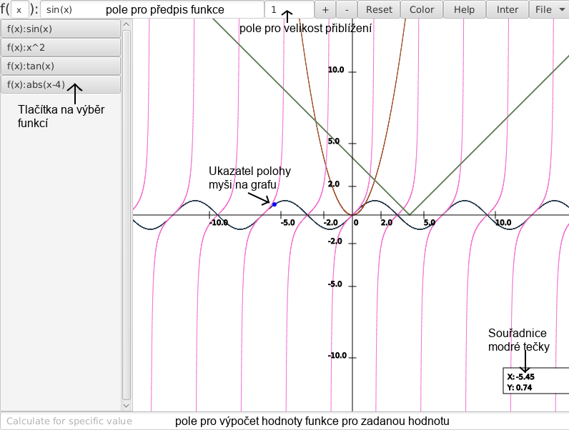

# GraphDraw

Simple javaFX application for drawing graphs of mathematical functions of single real variable.

## Features
* draw multiple graphs at the same time
* calculate intersections
* calculate function value for given variable value
* export functions to JSON to import later

